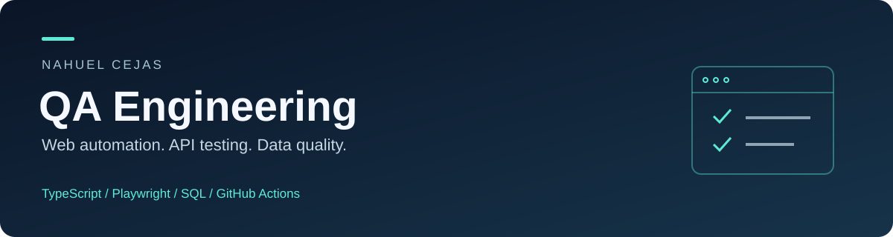

<p align="center">
  
</p>

<p align="center">
  <a href="https://github.com/nahueleze2004-glitch/QA-Portfolio-Ecommerce-Testing/actions/workflows/qa.yml"></a>
  <a href="https://github.com/nahueleze2004-glitch/QA-Portfolio-Ecommerce-Testing/actions/workflows/e2e.yml"></a>
</p>

# QA Engineer Portfolio

**Nahuel Cejas · TypeScript · Playwright · API Testing · SQL · CI/CD**

Portfolio de QA enfocado en un problema concreto: comprobar que un cliente pueda ingresar, comprar y recibir resultados consistentes. Combina automatización web, pruebas HTTP y controles de calidad de datos, con código ejecutable y evidencia de CI.

[LinkedIn](https://www.linkedin.com/in/nahuel-cejas-050452308) · [Resultados](docs/VALIDATION.md) · [Estrategia](docs/TEST-STRATEGY.md) · [Cobertura](docs/COVERAGE.md)

## El proyecto en un minuto

| Área | Qué demuestra | Ver código |
| --- | --- | --- |
| **Web · 13 escenarios** | Login, sesión, carrito, orden de precios, compra y campos obligatorios | [Playwright + TypeScript](tests/ui) |
| **API · 16 escenarios** | Contratos HTTP, tokens, propiedad del pedido, cantidades, stock y errores | [API tests](tests/api/shop.spec.ts) |
| **SQL · 6 controles** | Referencias rotas, importes, conciliación de pagos e inventario | [Consultas y pruebas](sql) |
| **Integración continua** | Tipado, pruebas por proyecto, reportes y evidencias de fallos | [GitHub Actions](.github/workflows/qa.yml) |

**35 escenarios principales.** Los 13 casos web corren en Chromium de escritorio y emulación móvil Pixel 7. La suite anterior de [Cypress](Automation-Cypress/e2e) conserva 11 casos de regresión en un pipeline separado.

## Sistemas evaluados

- **Web:** [Swag Labs](https://www.saucedemo.com/), una aplicación pública de demostración.
- **API:** servicio local de práctica con un [contrato explícito](docs/API-CONTRACT.md). Cada test inicia una instancia aislada.
- **Datos:** dataset sintético de comercio electrónico en SQLite; cada control se comprueba con datos limpios y una anomalía inyectada.

Las tres áreas son ejercicios independientes. La API y el dataset SQL no pertenecen al backend de Swag Labs.

## Recorrido recomendado

1. [Estrategia y riesgos](docs/TEST-STRATEGY.md): qué se prioriza y por qué.
2. [Compra completa](tests/ui/checkout.spec.ts): validaciones de producto, importes y confirmación.
3. [Autorización de pedidos](tests/api/shop.spec.ts): acceso de otra cuenta y revocación de token.
4. [Conciliación SQL](sql/checks/SQL-05-payment-reconciliation.sql): comparación entre pagos y pedidos.
5. [Registro de ejecución](docs/VALIDATION.md): commit, entorno y resultados verificables.

## Ejecutar

Requisitos: Node.js 22+, npm y Python 3.12+. La suite web necesita acceso a Swag Labs.

```bash
git clone https://github.com/nahueleze2004-glitch/QA-Portfolio-Ecommerce-Testing.git
cd QA-Portfolio-Ecommerce-Testing
npm ci
npx playwright install chromium
npm run typecheck
npm test
npm run test:sql
```

En Linux, usar `npx playwright install --with-deps chromium` si faltan dependencias del sistema. Para trabajar sólo con Playwright se puede omitir la descarga del navegador de Cypress usando `CYPRESS_INSTALL_BINARY=0` al instalar dependencias.

| Comando | Uso |
| --- | --- |
| `npm run test:ui` | Web en Chromium de escritorio |
| `npm run test:mobile` | Web en emulación Pixel 7 |
| `npm run test:api` | HTTP contra la fixture local; no requiere navegador |
| `npm run test:sql` | Seis controles sobre SQLite |
| `npm run typecheck` | Comprobación estricta de TypeScript |
| `npm run test:report` | Abrir el último reporte HTML de Playwright |
| `npm run cypress:run` | Suite de regresión Cypress |

## Evidencia y mantenimiento

El pipeline genera reportes HTML y JUnit. Ante un fallo web conserva trazas, capturas y video; el job SQL adjunta su log. Los artefactos se descargan desde Actions y se conservan durante 14 días.

Las pruebas usan contextos aislados, selectores `data-test`, aserciones sobre estado y datos controlados. No incluyen esperas fijas ni reintentos automáticos. Las [decisiones técnicas](docs/DECISIONS.md) explican los compromisos de diseño.

[Plantilla de defectos](Bug-Reports/TEMPLATE.md) · [Caso manual de compra](Test-Cases/TC_E2E_Compra_Completa.md) · [Cobertura Cypress](Test-Cases/COVERAGE.md)

## Alcance

Proyecto de práctica. La emulación móvil no sustituye pruebas en dispositivos físicos. No incluye pagos reales, carga ni una auditoría de seguridad. La API es una fixture de pruebas, no un servicio para producción; todos los usuarios y datos son ficticios o públicos de la demo.

Siguientes pasos: ampliar navegadores, documentar exploración manual y agregar validaciones de accesibilidad.
